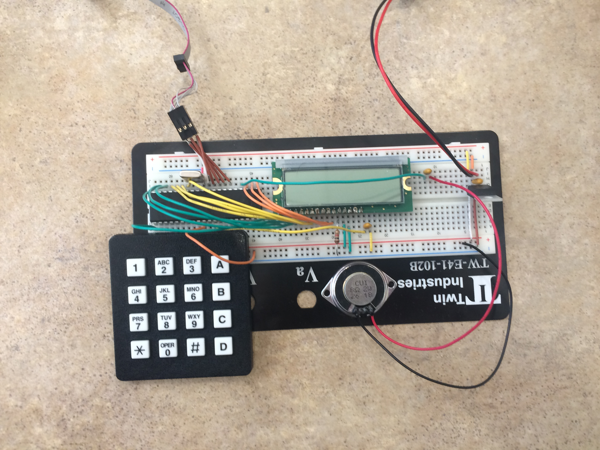
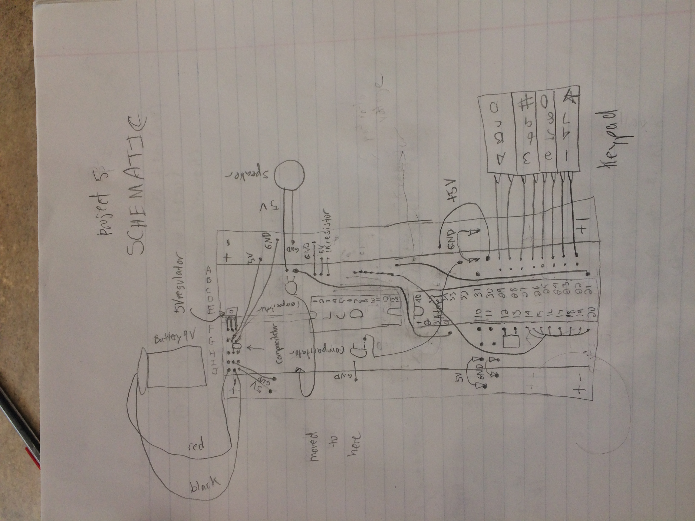

# Alarm Clock
This is the code for the my embedded alarm clock. You can set or adjust the clock to the current time and date and assign multiple alarms. When it hits the alarm time, the computer plays the song twinkle twinkle little star.

## Hardware
- Breadboard
- Programmar
- Microcontroller
- 9V Battery Connector
- 9V Battery
- Display
- LED
- 8MHz Crystal
- 5V Voltage Regulator
- 0.1uF Capacitor
- Push Button
- Speaker
- 100 Resistor
- 1k Resistor
- 10k Resistor
- Keypad
- Display Connector
- Soldering Iron
- Solder Wire

## Software
- C Programming Language

